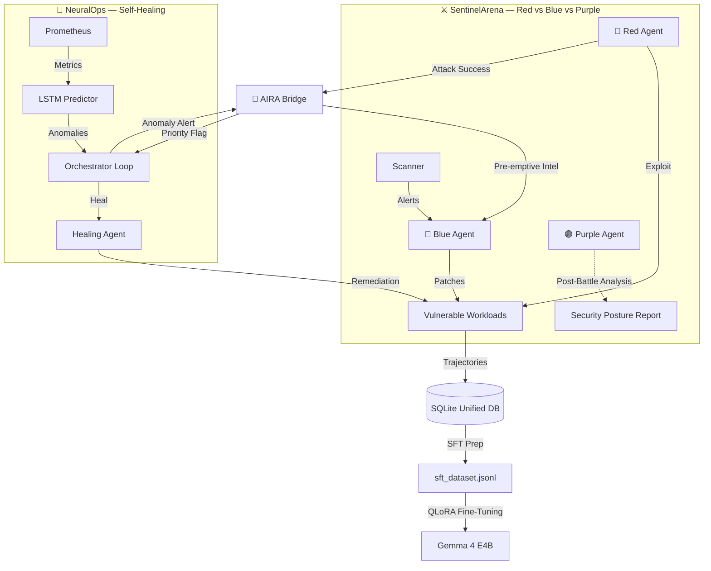

# AIRA: Autonomous Infrastructure Resilience Architecture
An open-source, autonomous Red vs. Blue vs. Purple agentic framework for Kubernetes security hardening and self-healing.

[](LICENSE)
[](https://kubernetes.io)
[](https://huggingface.co/google/gemma-4-e4b-it)

---

## 🚀 Overview

AIRA (Autonomous Infrastructure Resilience Architecture) is a multi-agent resilience platform. It combines autonomous security penetration/patching (SentinelArena) with ML-driven system anomaly detection and auto-remediation (NeuralOps), connected through a unified bridge.

AIRA operates as a continuous closed-loop system:
- 🔴 **Red Agent** identifies and exploits vulnerabilities across the cluster
- 🔵 **Blue Agent** dynamically implements patches, NetworkPolicies, and security baselines
- 🟣 **Purple Agent** synthesizes battle patterns into actionable security posture reports
- 🧠 **NeuralOps** predicts container failures and heals workloads before they crash
- 🌉 **Bridge** connects SentinelArena and NeuralOps for cross-system intelligence sharing



---

## ✨ Key Features

### SentinelArena (Red vs. Blue vs. Purple)
*   **Red Agent**: LLM-powered adversarial attacker that chains CVE/RBAC/Secret/Network exploits, governed by OPA policy enforcement.
*   **Blue Agent**: Autonomous defender that patches vulnerabilities, rotates secrets, and applies NetworkPolicies — both reactively and pre-emptively.
*   **Purple Agent**: End-of-battle meta-observer that analyzes the full attack/defense timeline and generates a structured Security Posture Report with pattern synthesis, blind spot identification, and prioritized remediation recommendations.
*   **Safety Orchestrator**: OPA-based governance layer with kill switch, escalation detection, spiral breaking, and rate limiting.

### NeuralOps (Self-Healing)
*   **LSTM Anomaly Predictor**: Trained on container telemetry (CPU, memory, disk, network) to predict failures before they happen.
*   **Orchestrator Loop**: Continuously monitors pods via Prometheus, runs LSTM inference, and dispatches the healing agent when anomalies are detected.
*   **Healing Agent**: LangGraph-powered remediation pipeline with tiered autonomy (auto-execute / notify / escalate to human).
*   **Remediation Catalog**: Pre-defined healing strategies for memory leaks, CPU throttles, cascading timeouts, and disk pressure.

### Cross-System Integration
*   **AIRA Bridge**: Bidirectional integration between SentinelArena and NeuralOps — Red attack success flags pods for priority NeuralOps monitoring; NeuralOps anomaly alerts feed into Blue Agent's defense prioritization.
*   **Unified Trajectory Exporter**: SQLite-backed trajectory database that formats multi-turn agent interactions into Hugging Face ChatML datasets for SFT training.

### Fine-Tuning Pipeline
*   **Gemma 4 QLoRA Pipeline**: 4-bit QLoRA fine-tuning scripts optimized for `google/gemma-4-e4b-it` on standard cloud GPUs (Kaggle T4/Colab T4).
*   **Automated Evaluation**: 50-prompt comparative benchmark (base vs. fine-tuned) measuring JSON parse rate, schema compliance, action validity, OPA compliance, and latency.

---

## 🛠️ Quickstart

### 1. Prerequisites
*   [Docker Desktop](https://www.docker.com/products/docker-desktop/)
*   [Kind](https://kind.sigs.k8s.io/docs/user/quick-start/) (Kubernetes in Docker)
*   [kubectl](https://kubernetes.io/docs/tasks/tools/)
*   Python 3.10+

### 2. Cluster Setup
```powershell
# Create Kind cluster
kind create cluster --name aira-cluster --config infra/kind-config.yaml

# Apply vulnerable demo workloads
kubectl apply -f infra/demo-services/
```

### 3. Environment Configuration
Copy `.env.template` to `.env` and configure your keys:
```env
GEMINI_API_KEY=your_gemini_api_key_here
AIRA_LIVE_SCAN=true
AIRA_LLM_BACKEND=gemini
```

### 4. Running a Battle
Run a multi-round Red vs. Blue battle with Purple Agent report at the end:
```powershell
python sentinel/main.py --rounds 5
```

### 5. Running the NeuralOps Orchestrator
Start the self-healing monitoring loop:
```powershell
# Single scan pass
python -m neuralops.orchestrator.orchestrator --once

# Continuous monitoring (30s interval, 10 cycles)
python -m neuralops.orchestrator.orchestrator --interval 30 --max-iterations 10
```

### 6. Running a Trajectory Campaign
Launch a multi-campaign run to generate SFT training data:
```powershell
python sentinel/run_campaign.py --campaigns 40 --battles 2 --rounds 5
```

---

## 🧠 Model Fine-Tuning & Evaluation

1. **Export the Dataset**:
   ```powershell
   python training/export_trajectories.py --output training/sft_dataset.jsonl --augment 5000
   python training/test_exporter.py
   ```
2. **Train on Kaggle/Colab**:
   Upload `sft_dataset.jsonl` with [finetune_gemma.ipynb](training/finetune_gemma.ipynb) to Kaggle, configure your `HF_TOKEN` secret, and run the pipeline.
3. **Verify Adapter Weights**:
   ```powershell
   python training/inspect_lora_keys.py
   ```
4. **Evaluation**:
   ```powershell
   .\run_eval.bat
   ```
   Outputs a comparative table to `docs/eval_report_base_vs_finetuned.md`.

---

## 📁 Project Structure

```
AIRA/
├── sentinel/                  # SentinelArena module
│   ├── agents/                # Red, Blue, Purple agent nodes
│   ├── graph/                 # LangGraph arena topology
│   ├── governance/            # OPA policy engine
│   ├── tools/                 # kubectl, scanner integrations
│   └── main.py                # Battle entry point
├── neuralops/                 # NeuralOps self-healing module
│   ├── prediction/            # LSTM model, inference pipeline, Prometheus fetcher
│   ├── orchestrator/          # Main monitoring loop
│   ├── agent/                 # Healing agent (LangGraph pipeline)
│   └── config.py              # NeuralOps settings
├── core/                      # Shared services
│   ├── bridge.py              # SentinelArena ↔ NeuralOps bridge
│   ├── unified_memory.py      # SQLite/PostgreSQL memory store
│   └── llm_client.py          # Multi-backend LLM client
├── training/                  # SFT pipeline
│   ├── export_trajectories.py # Trajectory → ChatML exporter
│   ├── finetune_gemma.ipynb   # QLoRA training notebook
│   ├── Modelfile              # Ollama model definition
│   └── sft_dataset.jsonl      # Training data (6,086 samples)
├── infra/                     # Kubernetes infrastructure
│   ├── kind-config.yaml       # Kind cluster config
│   └── demo-services/         # Vulnerable workload manifests
└── dashboard/                 # Real-time monitoring UI
```

---

## 🔮 Future Work

- **Reinforcement Learning Agent**: Replace SFT with RLHF/DPO to enable agents to learn optimal attack/defense strategies through reward signals rather than imitation.
- **Real Cluster Deployment**: Move from mock/Kind clusters to production-grade K8s with live Prometheus, Falco, and Jaeger integration.
- **Multi-Generation Self-Improvement**: Run multiple SFT generations (campaign → train → deploy → campaign) and track agent improvement curves.
- **Domain Expansion**: Extend beyond Kubernetes to cloud IAM, CI/CD pipelines, and network infrastructure.

---

## 📄 License
AIRA is open-source software licensed under the [Apache 2.0 License](LICENSE).
