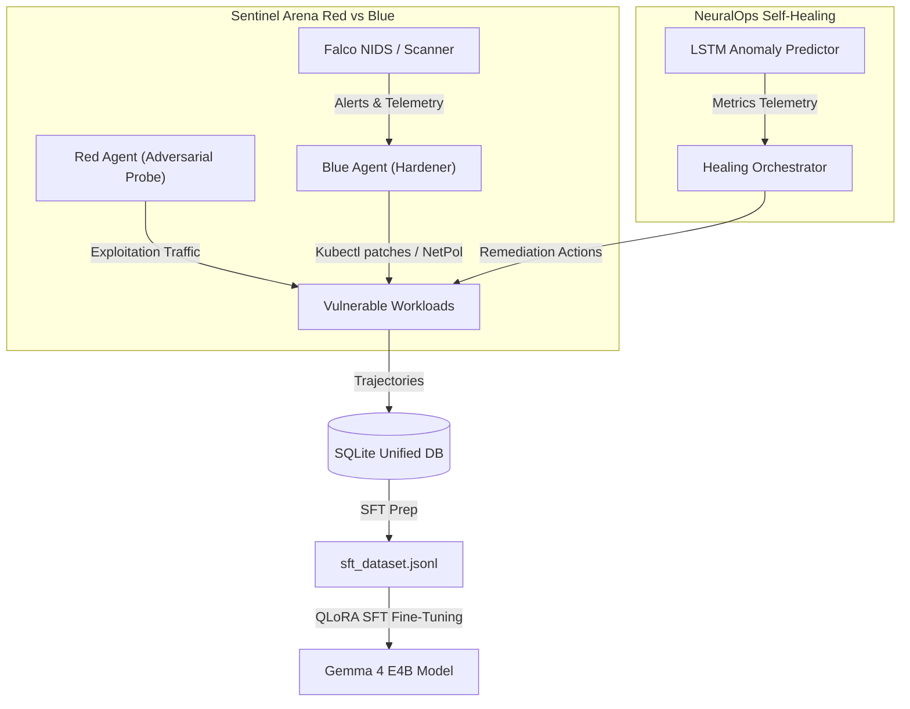

# AIRA: Autonomous Infrastructure Resilience Architecture
An open-source, autonomous Red vs. Blue agentic framework for Kubernetes security hardening and self-healing.

[](LICENSE)
[](https://kubernetes.io)
[](https://huggingface.co/google/gemma-4-e4b-it)

---

## 🚀 Overview

AIRA (Autonomous Infrastructure Resilience Architecture) is a state-of-the-art multi-agent resilience platform. It combines autonomous security penetration/patching (SentinelArena) with ML-driven system anomaly detection and auto-remediation (NeuralOps). 

AIRA operates as a continuous closed-loop game: the **Red Agent** identifies and exploits vulnerabilities, the **Blue Agent** dynamically implements patches and security context baselines, and the **NeuralOps Agents** predict failures and heal container workloads before they crash.



---

## ✨ Key Features

*   **SentinelArena (Red vs. Blue)**: Dual-agent reinforcement loop where a Red Agent runs automated CVE/RBAC/Secret exploits against Kind cluster workloads, and a Blue Agent automatically rolls out patches, NetworkPolicies, and secret rotations.
*   **NeuralOps (Self-Healing)**: An LSTM-driven predictive telemetry pipeline that detects container anomalies (memory leaks, CPU throttles, disk pressures) and initiates proactive healing runs.
*   **Unified Trajectory Exporter**: Programmatic SQLite trajectory database that formats multi-turn agent interactions into standard Hugging Face ChatML datasets for SFT training.
*   **Gemma 4 QLoRA Pipeline**: Out-of-the-box 4-bit QLoRA fine-tuning scripts optimized to train `google/gemma-4-e4b-it` on standard cloud GPUs (Kaggle T4/Colab T4) without memory errors or deadlocks.

---

## 🛠️ Quickstart

### 1. Prerequisites
Ensure you have the following installed locally:
*   [Docker Desktop](https://www.docker.com/products/docker-desktop/)
*   [Kind](https://kind.sigs.k8s.io/docs/user/quick-start/) (Kubernetes in Docker)
*   [kubectl](https://kubernetes.io/docs/tasks/tools/)
*   Python 3.10+

### 2. Cluster Setup
Initialize the vulnerable Kind cluster and deploy the target workloads:
```powershell
# Create Kind cluster
kind create cluster --name aira-cluster --config infra/kind-config.yaml

# Apply original vulnerable deployments
kubectl apply -f infra/demo-services/
```

### 3. Environment Configuration
Copy `.env.template` to `.env` and configure your keys:
```env
GEMINI_API_KEY=your_gemini_api_key_here
AIRA_LIVE_SCAN=true
AIRA_LLM_BACKEND=gemini
```

### 4. Running a Battle
Execute a single multi-round Red vs. Blue battle:
```powershell
python sentinel/main.py --rounds 5
```

### 5. Running a Trajectory Generation Campaign
Launch a multi-campaign automated run to generate SFT data:
```powershell
python sentinel/run_campaign.py --campaigns 40 --battles 2 --rounds 5
```

---

## 🧠 Model Fine-Tuning & Evaluation (SFT)

AIRA is designed to be fine-tuned on the trajectories it generates.

1. **Export the Dataset**: 
   Once your campaigns are complete, export and validate the SFT training dataset (which yields 1,086 real trajectories consolidated with 5,000 high-fidelity synthetic trajectories for a total of **6,086 total SFT samples**):
   ```powershell
   python training/export_trajectories.py --output training/sft_dataset.jsonl --augment 5000
   python training/test_exporter.py
   ```
2. **Train on Kaggle/Colab**:
   Upload `sft_dataset.jsonl` along with [finetune_gemma.ipynb](training/finetune_gemma.ipynb) or [finetune_gemma.py](training/finetune_gemma.py) to Kaggle or Colab, configure your `HF_TOKEN` secret, and run the training pipeline to save LoRA adapter weights.
3. **Verify Adapter Weights**:
   Download the completed adapter weights folder, place it in `training/gemma-4-e4b-aira-lora/`, and run the validation check:
   ```powershell
   python training/inspect_lora_keys.py
   ```
4. **Base vs. Fine-Tuned Model Evaluation**:
   Open Ollama and run our automated evaluation launcher to create the compiled model and run the 50-prompt comparative test:
   ```powershell
   .\run_eval.bat
   ```
   This will output a comparative markdown table to `docs/eval_report_base_vs_finetuned.md` summarizing formatting rates, latency, schema compliance, and safety.


---

## 📄 License
AIRA is open-source software licensed under the [Apache 2.0 License](LICENSE).
