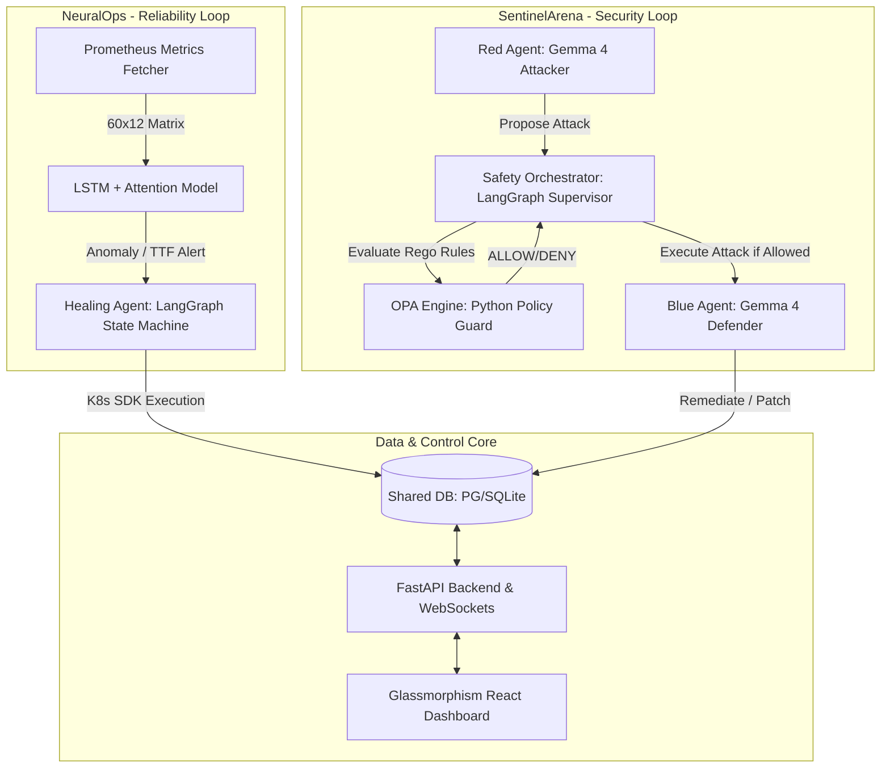

# AIRA — Unbiased Technical Review & Core Logic Analysis

## 1. Architectural Map: How it Works

AIRA (Autonomous Infrastructure Resilience Architecture) is a hybrid autonomous operations platform designed to run 24/7 on a Kubernetes cluster. It bridges two distinct operational domains—Security and Reliability—using a unified relational data layer, REST/WebSocket API endpoints, and a cyberpunk command center dashboard.



### A. The Security Axis: SentinelArena
An adversarial Red-vs-Blue arena. The **Red Agent** continuously scans, finds, and attempts to exploit cluster vulnerabilities. The **Blue Agent** monitors the cluster, detects the threat vectors, and applies security patches or network policies. A central supervisor governs them under strict policies.

### B. The Reliability Axis: NeuralOps
A predictive system-health engine. A custom **LSTM neural network** ingests time-series metrics from Prometheus to identify anomalies before they lead to an outage. If a failure is predicted, a stateful **Healing Agent** automatically triggers diagnostics (querying Loki logs and Jaeger traces) and executes self-healing Kubernetes commands.

---

## 2. Key Code Logics & Core Implementations

Below are the exact code architectures and mathematical logics running under the hood:

### A. NeuralOps: The LSTM + Attention Engine (`neuralops/prediction/lstm_model.py`)
Instead of a simple feedforward network, the model uses a hybrid **LSTM with Temporal Attention** to process a sliding window of recent Prometheus metrics ($60 \text{ timesteps} \times 12 \text{ features}$, representing roughly 5 minutes of infrastructure history).

* **Feature Vector:** Tracks memory usage bytes/limits/percentage, CPU usage cores/limits/percentage, restart counts, network RX/TX, disk usage, HTTP error rate, and P99 response latency.
* **Architecture:**
  1. **Input Normalization:** `nn.LayerNorm(n_features)` stabilizes raw telemetry inputs.
  2. **Sequence Processing:** 2-layer LSTM maps normalized sequence to high-dimensional hidden space.
  3. **Temporal Attention:** A Sequential neural block generates weights indicating step importance (e.g., a sudden spike at step 52) which is applied via weighted pooling:
     ```python
     attn_weights = self.attention(lstm_out)       # Shape: (batch, window, 1)
     context = (attn_weights * lstm_out).sum(dim=1)  # Weighted pooling -> Shape: (batch, hidden_size)
     ```
  4. **Multi-head Classifier:** One classification head computes probabilities for the 4 failure classes (`memory_leak`, `cpu_throttle`, `cascading_timeout`, `disk_pressure`). A separate independent anomaly head outputs a continuous anomaly rating (0.0 to 1.0).

* **TTF (Time-to-Failure) Estimation Logic:** The system estimates the remaining time until a hard failure by mapping the classifier's top confidence output against calibrated decay coefficients:
  $$\text{TTF} = \text{max}\left(1.0, \ \text{slope} \times \text{confidence} + \text{intercept}\right)$$
  For a memory leak, a high-slope coefficient ensures that a rapidly spiking confidence yields a dangerously low, urgent TTF.

---

### B. NeuralOps: Tiered Autonomy State Machine (`neuralops/agent/healing_agent.py`)
To prevent an AI from making destructive operational mistakes, the **LangGraph Healing Agent** implements a strict **Tiered Autonomy Gate** before executing any `kubectl` commands:

* **Tier Decision Logic in decide_node:**
  ```python
  if conf >= 0.85 and past_rate >= 0.8 and not is_destructive:
      tier = "TIER_1"          # AUTO-EXECUTE: Fully autonomous, zero human intervention.
      requires_human = False
  elif conf >= 0.65 and not is_destructive:
      tier = "TIER_2"          # EXECUTE + NOTIFY: Execute immediately, but broadcast alerts to Slack/Dashboard.
      requires_human = False
  else:
      tier = "TIER_3"          # ESCALATE: Lock execution, hold the state in DB, and wait for manual human approval.
      requires_human = True
  ```

---

### C. SentinelArena: OPA Governance & Safety Orchestrator (`sentinel/agents/orchestrator.py`)
The **Safety Orchestrator** is a central, non-LLM symbolic gate. It acts as an absolute boundary controller, protecting the cluster.

* **Rego-Equivalent OPA Policy (`governance/opa_engine.py`):** Before *any* attack can run, it is parsed by OPA rules checking for protected namespaces (`kube-system`, `monitoring`, `kube-public`, `sentinel-arena`), forbidden action types (`host_escape`, `etcd_access`, `node_exec`), and the **Blast Radius** limit (cannot affect $> 75\%$ of the cluster resources).
* **Escalation Detection:** It scans proposed text for escape attempts:
  ```python
  escalation_keywords = ["host filesystem", "/proc/1", "nsenter", "chroot", "escape sandbox"]
  ```
* **Spiral Detection Logic:** If the Red Agent gets blocked and repeatedly tries to hammer the same resource, the orchestrator detects an infinite loop:
  ```python
  if not allowed:
      new_spiral_counter += 1
      if new_spiral_counter >= SPIRAL_THRESHOLD:
          # Trigger emergency strategy reset / kill switch to break the loop!
  ```

---

## 3. Unbiased Technical Review: How Good is the System?

Let’s strip away the marketing fluff and look at the system with rigorous, straight-shooting engineering critique.

### 🟢 Core Strengths: Where the System Shines
1. **Hybrid Architecture (Symbolic + Deep Learning):** By combining a fast mathematical network (LSTM) for signal monitoring, a strict symbolic gate (OPA) for security, and a stateful graph (LangGraph) for reasoning, the system avoids the fatal flaw of "pure LLM" agents. The LLM does not decide the metrics or the hard safety boundaries; it only does what it's good at: log analysis, diagnosis, and plan drafting.
2. **Deterministic Security Constraints:** The pythonic OPA engine and the LangGraph orchestrator guarantee that even if the Gemma/Gemini model hallucinates or goes rogue, it physically cannot execute commands in forbidden namespaces or bypass the blast radius without triggering a hard-coded Python boundary block.
3. **Local Sovereignty:** Migrating from cloud-based APIs to a local Gemma 4 LoRA adapter means the entire platform runs completely air-gapped. Telemetry logs, cluster architectures, and security vulnerabilities never leave your local infrastructure.

### 🔴 Technical Bottlenecks & Limitations: The Raw Truth
1. **Synthetic Data Dependency for LSTM:**
   * *The Problem:* The LSTM is trained on clean, mathematically perfect synthetic trajectories of memory leaks and CPU throttles.
   * *The Reality:* Real-world clusters are incredibly noisy. "Co-located workloads," network spikes, temporary I/O wait peaks, and garbage collection runs introduce massive variance. On a production cluster, this model is highly likely to experience a surge in false positives (hallucinating anomalies) or miss compound failures that don't match the synthetic mathematical curves.
2. **Parser-Level Security Bypasses:**
   * *The Problem:* The escalation detector and OPA checks rely heavily on keyword matching and structured JSON parsing.
   * *The Reality:* If a creative Red Agent manages to obfuscate its payload (e.g., executing a base64 encoded string, utilizing shell gymnastics like `$(printf '\x2f\x70\x72\x6f\x63')` to target `/proc`, or exploiting an unmapped zero-day), the text-based OPA engine will happily allow it. It is *not* a kernel-level sandbox.
3. **SQLite Concurrency Bottleneck:**
   * *The Problem:* The system includes an SQLite database fallback.
   * *The Reality:* Under a rapid Red/Blue battle where live events are firing, Prometheus is reporting metrics, and the dashboard is streaming WebSockets, SQLite will run into severe thread locking (`database is locked`). A production deploy *requires* PostgreSQL.
4. **LoRA Fine-Tuning Scale:**
   * *The Problem:* 100 steps of QLoRA on a T4 GPU is a behavior-alignment run.
   * *The Reality:* While 100 steps aligns the *format* (ensuring the model outputs perfect JSON matching schemas and speaks like a resilience agent), it does not teach the model new security vulnerabilities or advanced hacking skills. The model is only as smart as the pre-trained knowledge base inside the base Gemma 4 model.

---

### ⚖️ The Verdict
AIRA is **architecturally excellent**. Its structural division of labor (LangGraph for routing, OPA for hard-policing, LSTM for telemetry modeling) is far superior to standard "chat-with-your-infra" wrapper bots. 

However, it is a **closed-loop system** designed around a structured sandboxed playground. To transition it to an enterprise-grade mission-critical platform, the LSTM needs to be retrained on real, noisy cluster benchmarks, and the text-based OPA engine should eventually connect to a real, isolated gVisor/MicroVM runtime sandbox.
